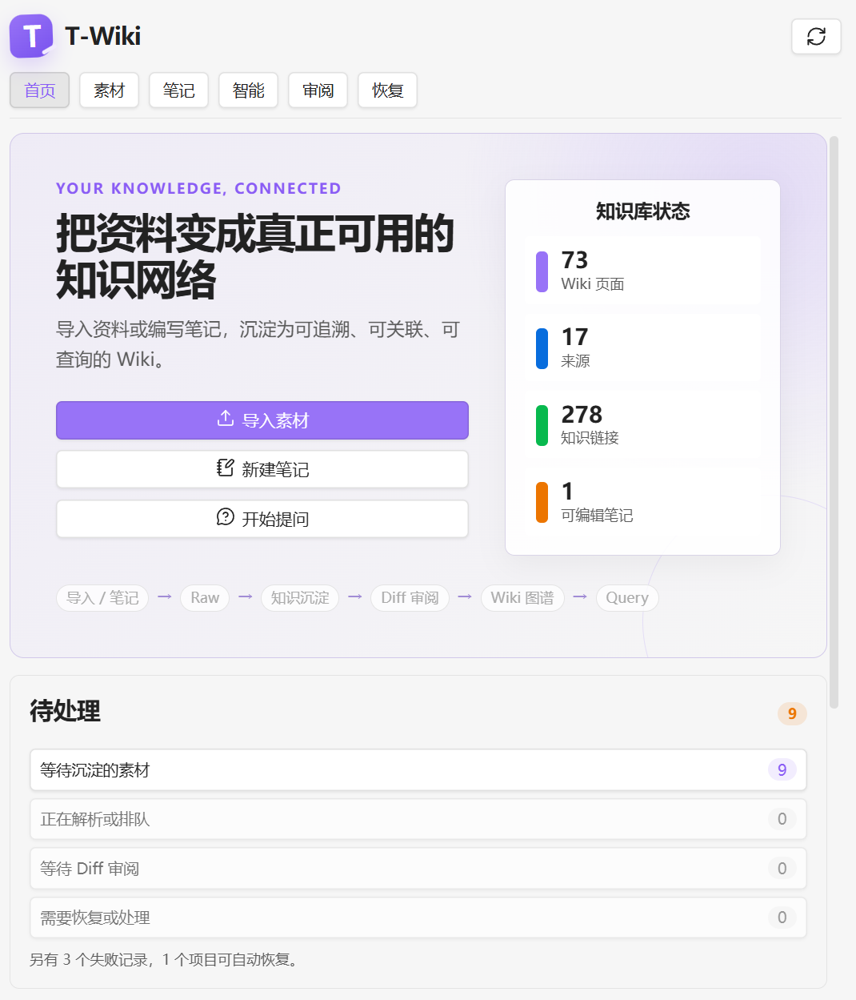

# T-Wiki for Obsidian

把文档、网页、音视频和个人笔记整理成**可追溯、可审阅、相互链接**的 Markdown 知识库。

T-Wiki 在 Obsidian 中提供一条完整的知识沉淀流程：统一解析不同来源，由 LLM Agent 提取并比较知识，展示 Diff 供用户确认，最后写入 Wiki 并建立可用于多跳查询的链接图谱。

> T-Wiki 不要求安装 Claude Code。Agent Runtime 已内置在插件中，但需要用户自行提供兼容的 LLM API。

[Obsidian 社区页面](https://community.obsidian.md/plugins/t-wiki) · [GitHub Releases](https://github.com/OperationT00/T-wiki/releases) · [更新记录](CHANGELOG.md) · [安全说明](SECURITY.md)



## T-Wiki 能解决什么问题

资料进入 Obsidian 后，通常仍然只是彼此独立的文件。手动阅读、拆分概念、维护链接和更新旧笔记需要持续投入时间；直接让 AI 改写 Vault，又容易出现来源不清、重复页面和错误覆盖。

T-Wiki 将这项工作拆成一条可检查的流程：

```text
导入资料或编写笔记
→ 生成标准化 Raw
→ Agent 提取并比较知识
→ 用户审阅 Diff
→ 写入 Wiki 并建立链接
→ 基于索引和图谱进行查询
```

- **Raw 保留事实来源**：解析结果与原件 Hash 绑定，Wiki 内容可以追溯到实际读取的证据。
- **AI 负责判断，宿主负责约束**：LLM 判断知识价值和合并方式，插件负责路径、Evidence、并发冲突和结构校验。
- **写入前必须审阅**：Agent 只生成暂存变更，用户确认 Diff 后才修改 `wiki/`。
- **知识不是孤立页面**：Source、Concept、Entity 和 Synthesis 通过 WikiLink 相连，可供 Query 多跳探索。

<!-- TODO: 补充一段 30–60 秒的演示 GIF 或视频链接，内容建议为“导入文档 → Ingest → Diff → Query”。 -->

## 核心功能

### 收集与解析

- 导入 Markdown、TXT、文本型 PDF 和本地音视频。
- 抓取公开网页正文，或扫描 Obsidian Web Clipper Inbox。
- 读取 Bilibili 公开字幕；无字幕时可在确认后进行语音转写。
- 通过用户安装的 yt-dlp 获取抖音单个公开视频。
- 将不同来源统一发布为可验证的 `raw/` Markdown。
- 使用 PDF.js 本地解析 PDF，可选 MinerU 处理扫描件和复杂版式。
- 可选 FFmpeg、远程 ASR 和视觉模型，生成带时间戳与关键画面的图文文字稿。

### 知识沉淀

- LLM Agent 从 Raw 中提取 Entity、Concept 和 Synthesis 候选。
- 先比较已有 Wiki，再决定创建、更新、跳过或仅保留 Source。
- 自动建立并验证 Source、知识页面和关联页面之间的 WikiLink。
- Evidence 记录本轮实际读取的来源章节，并绑定支持结论的原文片段。
- 对数字、百分比、日期等具体事实执行额外一致性检查。

### 笔记与 Raw 修订

- 在 `notes/t-wiki/` 中创建并持续编辑个人笔记。
- 从已验证 Raw 创建修订稿，不直接覆盖不可变来源。
- 发布快照时归档本地图片，并生成新的可追溯 Raw 来源。
- 支持版本 Diff、发布历史和三方 Rebase；冲突必须由用户选择处理方式。
- 再次沉淀同一笔记时优先处理变化章节，必要时自动回到完整 Ingest。

### 审阅、恢复与回滚

- 所有 Wiki 修改先进入隔离的 WorkingSet。
- Diff Review 支持逐页接受或拒绝；Source 页面保持强制追溯。
- CAS 检查可阻止覆盖审阅期间发生变化的 Wiki 文件。
- Transaction Journal 用于恢复中断的 Wiki 写入。
- Pending Plan、ParseAttempt 和媒体 Checkpoint 支持跨重启继续处理。
- 恢复中心集中展示可恢复任务、损坏记录和需要人工处理的冲突。

### 索引与多跳查询

- 从由 Wiki 派生的 Navigation Index 判断相关入口页面。
- 先读取页面目录，再按需读取相关章节，减少无关上下文。
- 沿正文 WikiLink、`related` 和 backlinks 进行双向、多跳探索。
- 引用必须指向本轮实际读取且 Hash 仍然一致的 Wiki 页面。
- Standard 模式用于常规问题；Deep 模式允许扩大探索并回溯 Raw。

## 快速开始

### 1. 安装插件

在 Obsidian 中打开 **设置 → 第三方插件 → 浏览**，搜索 **T-Wiki** 并安装。

也可以从 [GitHub Releases](https://github.com/OperationT00/T-wiki/releases) 下载以下文件：

- `main.js`
- `manifest.json`
- `styles.css`

将它们放入：

```text
<Vault>/.obsidian/plugins/t-wiki/
```

重新启动 Obsidian，然后启用 T-Wiki。

### 2. 初始化知识库

打开右侧 T-Wiki 工作台，在首页点击 **初始化 T-Wiki**。初始化只会在当前 Vault 创建目录、模板、索引和内部状态，不会上传资料或调用 LLM。

主要目录包括：

```text
raw/              标准化且可验证的来源 Markdown
wiki/             审阅后写入的知识页面
notes/t-wiki/     用户可编辑笔记和 Raw 修订稿
templates/        Wiki 页面模板
.llm-wiki/        Manifest、索引、事务和恢复状态
```

### 3. 配置 LLM API

进入 **设置 → T-Wiki → 常规**：

1. 选择 `Anthropic Messages` 或 `OpenAI-compatible` 协议。
2. 填写服务的 Base URL 和 API Token。
3. 为 Fast、Default、Deep 三种角色选择模型；不需要区分时可以使用同一个模型。
4. 点击 **测试连接**。

兼容服务必须支持原生 Tool Calling。API Token 只保存在 Obsidian Secret Storage，不会写入 Wiki、Manifest 或插件配置文件。

<!-- TODO: 补充实际验证过的服务商与模型列表，注明协议、Base URL 示例、Tool Calling 和结构化输出兼容情况。不要在截图中包含 API Token。 -->

### 4. 导入并沉淀第一份资料

1. 在 **素材** 页面导入文件、抓取网页或选择在线视频来源。
2. 等待 Parse 完成，并按需预览生成的 Raw Markdown。
3. 点击 **开始 Ingest**。
4. Agent 读取来源、比较已有 Wiki，并生成创建或更新建议。
5. 在 **审阅** 页面检查 Diff，选择需要接受的页面。
6. 确认后写入 Wiki，再到 **智能** 页面提问。

<!-- TODO: 补充两张操作截图：素材页的“开始 Ingest”和审阅页的 Diff。建议避免使用包含私人文件名的真实 Vault。 -->

### 5. 从自己的笔记开始

1. 在 **笔记** 页面点击 **新建笔记**。
2. 输入标题，在 Obsidian 中正常编写 Markdown。
3. 选择 **发布快照**，只生成不可变 Raw；或者选择 **发布并沉淀**，继续进入 Ingest。
4. 审阅 Agent 生成的 Wiki Diff 后再确认写入。

不要直接修改 `raw/`。需要修正已导入内容时，请在素材页创建 Raw 修订稿；旧 Raw 会继续作为不可变历史保留。

## 支持的来源与可选组件

| 来源 | 默认处理方式 | 可选能力或依赖 |
|---|---|---|
| Markdown / TXT | 本地解析与规范化 | 无 |
| PDF | PDF.js 本地解析 | MinerU Cloud 或自托管 MinerU |
| 公开网页 | 本地提取正文 | Web Clipper Inbox |
| 本地音频 | 远程 ASR 生成文字稿 | FFmpeg 预处理、分片恢复、Fast 模型格式整理 |
| 本地视频 | ASR 生成文字稿 | FFmpeg 抽帧和独立视觉模型 |
| Bilibili | 平台公开字幕优先 | 无字幕时远程 ASR |
| 抖音 | yt-dlp 下载公开视频 | FFmpeg、远程 ASR 和视觉模型 |
| 用户笔记 | 本地 Markdown 编辑 | 发布快照后进入 Ingest |

### 可选解析配置

- **MinerU**：在“文档解析”中配置 Cloud 或自托管服务。启用后，扫描型或复杂 PDF 可能上传到所配置的服务。
- **Web Clipper Inbox**：在“来源采集”中填写专用 Inbox。T-Wiki 只扫描该目录，导入后不会自动 Ingest。
- **音视频转写**：在“音视频”中选择 OpenAI-compatible `/audio/transcriptions` 或 Whisper ASR Webservice `/asr`。每次上传或恢复前都需要单独确认。
- **关键画面**：配置 FFmpeg/FFprobe 和 OpenAI-compatible 视觉模型后，插件会筛选关键帧并插入对应时间段。
- **Bilibili**：支持 BV、AV 和 b23 地址；优先使用作者字幕或平台 AI 字幕。
- **抖音**：需要单独安装 yt-dlp。默认不读取浏览器 Cookie，只有下载器明确要求登录时才申请一次性授权。

更详细的音视频说明见 [docs/media-parsing.md](docs/media-parsing.md)。

<!-- TODO: 补充音视频配置页面截图，并列出至少一个已经手工验收的 ASR、视觉模型和 FFmpeg 版本组合。 -->

## 数据、隐私与安全

- 默认文件操作限制在当前 Vault；Raw、Wiki、索引和恢复状态都保存在本地。
- Ingest 和 Query 会将相关 Raw/Wiki 上下文发送到用户配置的 LLM API。
- MinerU、ASR 和视觉服务可能接收 PDF、音频、视频缩略图或相关文字，请根据资料敏感程度选择服务。
- 远程媒体上传必须逐任务确认；授权不会写入 Manifest。
- API Token 使用 Obsidian Secret Storage，不写入 Markdown、日志或普通配置。
- FFmpeg、FFprobe 和 yt-dlp 仅在用户启用相关功能并主动发起任务时执行，参数不会交给 LLM 生成。
- T-Wiki 不提供遥测；质量验收数据只保存在本地。

完整安全边界和漏洞报告方式见 [SECURITY.md](SECURITY.md)。

## 使用限制

- 当前仅支持 Obsidian 桌面端。
- 当前界面以中文为主。
- 必须自行提供兼容且支持原生 Tool Calling 的 LLM API。
- FFmpeg、yt-dlp、MinerU、ASR 和视觉模型均为可选能力，不随插件分发。
- 本阶段只分析音视频的字幕、音轨和抽取画面，不进行完整视频语义理解。
- Bilibili、抖音等平台能力可能受公开接口和 yt-dlp 站点适配变化影响。
- LLM 结果仍可能不完整或判断错误，请在 Diff Review 中核对重要内容和数字。

<!-- TODO: 确认正式发布时支持的最低 Windows/macOS/Linux 环境，并补充已知兼容性问题链接。 -->

## 常用命令

以下 Slash Command 可在 T-Wiki 的智能输入框中使用：

| 命令 | 作用 |
|---|---|
| `/query <问题>` | 查询 Wiki |
| `/query <问题> --deep` | 深度查询，并允许回溯 Raw |
| `/query <问题> --scope wiki\|raw\|hybrid` | 指定查询范围 |
| `/save [内容]` | 将内容或最近回答保存为 Wiki 页面 |
| `/save --type output\|synthesis` | 指定保存页面类型 |
| `/lint` | 检查 Wiki 健康状态 |
| `/lint --fix` | 生成可审阅的修复建议 |
| `/reindex` | 重建 Wiki 索引 |
| `/agent status` | 查看当前 Agent 状态 |
| `/agent cancel` | 取消当前 Agent 任务 |

Ingest 通常直接在素材页操作，也支持：

| 命令 | 作用 |
|---|---|
| `/ingest scan` | 查看可处理来源 |
| `/ingest process <sourceId或raw路径>` | 处理单个来源 |
| `/ingest batch <来源1> <来源2> ...` | 批量处理 1–5 个来源 |
| `/ingest status [sourceId]` | 查看 Ingest 状态 |
| `/ingest retry <sourceId或raw路径>` | 重试失败的 Ingest |

遇到异常退出或恢复问题时，可以在 Obsidian 命令面板执行 **T-Wiki: 打开恢复中心**。

## 常见问题

### T-Wiki 会直接修改我的原始资料吗？

不会。导入来源发布为不可变 Raw；用户修订通过新快照表达。Agent 对 Wiki 的修改先进入 WorkingSet，并在用户确认 Diff 后才应用。

### 必须使用某个指定模型吗？

不需要。T-Wiki 支持 Anthropic Messages 和 OpenAI-compatible 协议，但服务必须正确实现原生 Tool Calling。模型质量会影响候选提取、知识合并和回答效果。

### 为什么 Parse 完成后没有立即生成 Wiki？

Parse 只负责把来源转换为标准 Raw。需要用户主动开始 Ingest，Agent 才会提取知识；最终仍需通过 Diff Review。

### 可以完全离线使用吗？

Markdown、TXT、部分 PDF 解析和本地文件管理可以离线完成。Ingest、Query、远程 OCR、ASR 和视觉分析需要相应的本地或远程兼容服务。

<!-- TODO: 根据用户反馈补充 3–5 个高频问题，例如 Provider 连接失败、扫描 PDF、长视频和恢复中心。 -->

## 文档与更新

- [更新记录](CHANGELOG.md)
- [音视频解析](docs/media-parsing.md)
- [恢复中心](docs/recovery-center.md)
- [固定质量与性能验收](docs/quality-acceptance.md)
- [社区审核与安全检查](docs/community-review-audit.md)
- [安全策略](SECURITY.md)

<!-- TODO: 补充反馈渠道。可以使用 GitHub Issues，也可以加入讨论区、邮箱或社区帖子，但不要填写私人联系方式。 -->

## 开发

```powershell
npm.cmd install
npm.cmd run verify
npm.cmd run build
npm.cmd run acceptance -- --input .llm-wiki-acceptance/observations.json
```

生产构建输出位于 `dist/`。发布版本需要保证 `package.json`、`manifest.json`、`versions.json`、Git Tag 和 GitHub Release 版本一致。

## License

[MIT](LICENSE) © T00
