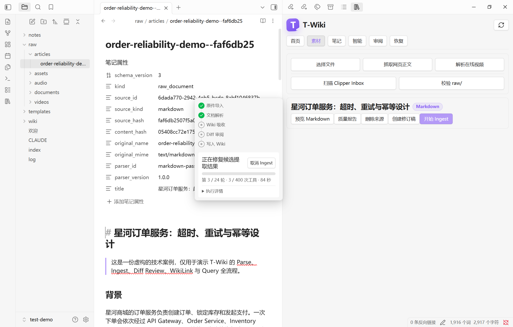
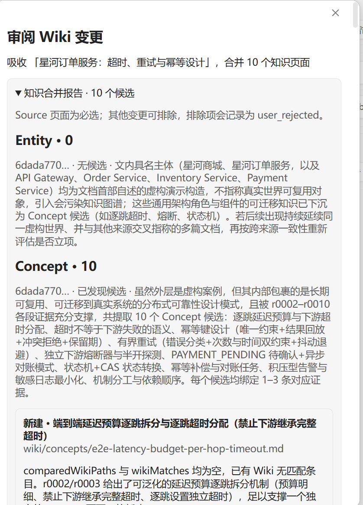
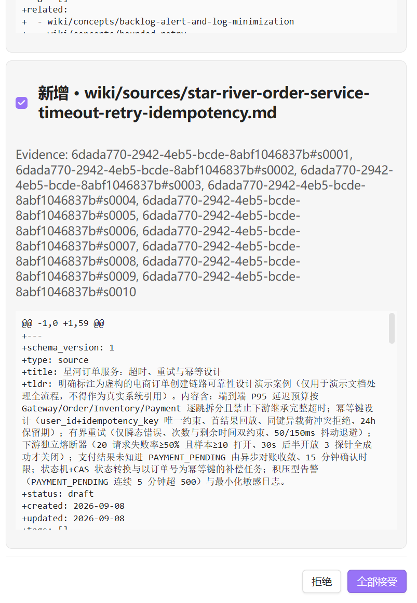
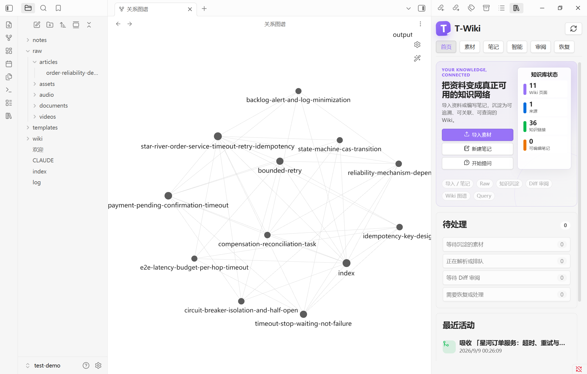
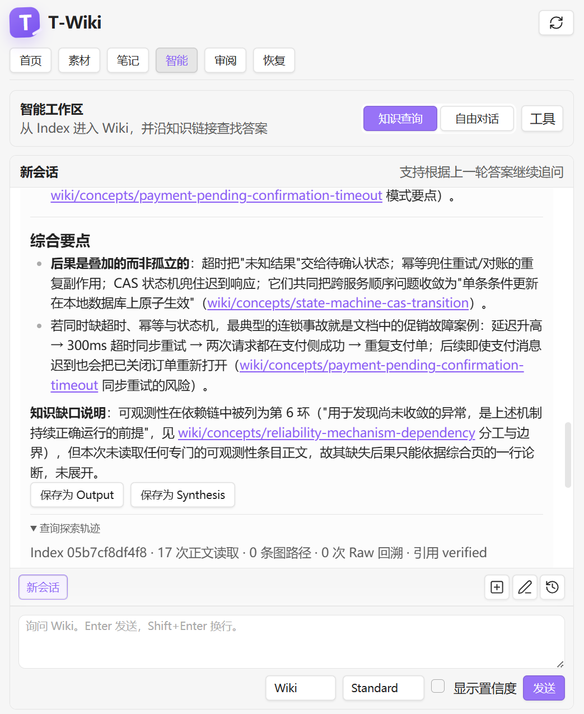

# T-Wiki for Obsidian

把文档、网页、音视频和个人笔记整理成**可追溯、可审阅、相互链接**的 Markdown 知识库。

T-Wiki 不只是生成一份摘要。它先保留标准化来源，再由 LLM Agent 比较现有知识、提出变更，经过用户审阅后写入 Wiki，最后通过索引和 WikiLink 支持关联查询。

> T-Wiki 不要求安装 Claude Code。Agent Runtime 已内置在插件中，但需要用户自行提供支持原生 Tool Calling 的 LLM API。

[Obsidian 社区页面](https://community.obsidian.md/plugins/t-wiki) · [GitHub Releases](https://github.com/OperationT00/T-wiki/releases) · [更新记录](CHANGELOG.md) · [安全说明](docs/SECURITY.zh-CN.md)

## T-Wiki 工作台


从首页可以导入素材、创建笔记或开始提问，并查看 Wiki 页面、来源、知识链接和待处理任务。

## 工作流程

```text
导入或编写 → Raw → 知识沉淀 → Diff 审阅 → Wiki 图谱 → Query
```

### 1. Parse 与 Ingest

资料先被解析为带来源 Hash 的 canonical Raw。用户开始 Ingest 后，Agent 才会阅读原文、比较已有 Wiki 并生成知识候选。



### 2. Diff 审阅

Agent 不会直接修改 `wiki/`。候选报告和逐页 Diff 会先交给用户检查，知识页面可以接受或拒绝，Source 页面负责保留来源追溯。

| 候选与覆盖报告 | Evidence、Diff 与应用 |
| --- | --- |
|  |  |

### 3. Wiki 图谱

通过审核后，Source、Concept、Entity 和 Synthesis 以 Markdown WikiLink 相连，可以直接使用 Obsidian 图谱和反向链接。



### 4. Query

Query 从 Navigation Index 选择相关 Wiki，再按需读取正文、沿链接继续探索，并校验最终引用。



这张图展示的是 Index 导航、按需正文读取和引用校验；只有问题需要关系上下文时，Query 才会继续沿 WikiLink 和 backlinks 探索。

## 主要能力

- 导入 Markdown、TXT、PDF、网页、本地音视频和个人笔记。
- 可选 MinerU、Bilibili 字幕、远程 ASR、FFmpeg 关键帧和抖音 yt-dlp。
- 将不同来源统一发布为可验证、可追溯的 Raw Markdown。
- 提取 Entity、Concept 和 Synthesis，并先与已有 Wiki 比较。
- 使用 Evidence 支持结论，并额外检查数字、百分比和日期。
- 自动建立并校验 Source 与知识页面之间的 WikiLink。
- 支持个人笔记、Raw 修订、版本 Diff 和三方 Rebase。
- 使用 WorkingSet、CAS 和事务写入保护 Vault。
- 通过 Pending Plan、ParseAttempt、媒体 Checkpoint 和恢复中心处理意外中断。

## 快速开始

### 1. 安装插件

在 Obsidian 中打开 **设置 → 第三方插件 → 浏览**，搜索 **T-Wiki** 并安装。

也可以从 [GitHub Releases](https://github.com/OperationT00/T-wiki/releases) 下载 `main.js`、`manifest.json` 和 `styles.css`，放入：

```text
<Vault>/.obsidian/plugins/t-wiki/
```

重新加载 Obsidian，然后启用 T-Wiki。插件仅支持桌面端。

### 2. 初始化知识库

打开右侧 T-Wiki 工作台，在首页点击 **初始化 T-Wiki**，填写知识库名称、知识领域、目标读者和语言。

初始化会在当前 Vault 创建：

```text
raw/              标准化且可验证的来源 Markdown
wiki/             审阅后写入的知识页面
notes/t-wiki/     用户笔记和 Raw 修订稿
templates/        Wiki 页面模板
.llm-wiki/        Manifest、索引、事务和恢复状态
```

初始化不会上传资料或调用 LLM。

### 3. 配置 LLM API

进入 **设置 → T-Wiki → 常规**：

1. 选择 `Anthropic Messages` 或 `OpenAI-compatible Chat Completions`。
2. 填写服务商要求的 Base URL 和 API Token。
3. 为 Fast、Default、Deep 三种角色选择模型；只有一个模型时可以重复使用。
4. 保持结构化输出为 `Auto`，并填写模型实际支持的 Context Window。
5. 点击 **测试连接**，通过两轮 Tool Call / Tool Result 续轮测试后再正式使用。

API Token 只保存到 Obsidian Secret Storage。兼容服务必须正确实现原生 Tool Calling；仅能聊天的接口无法完成 Ingest 和 Query。

### 4. 导入、沉淀和查询

1. 在 **素材** 页面选择文件或抓取来源。
2. 等待 Parse 完成，按需点击 **预览 Markdown** 检查 Raw。
3. 点击 **开始 Ingest**。
4. 在 **审阅** 页面检查并应用 Diff。
5. 打开生成的 Wiki 页面，或进入 **智能 → 知识查询** 提问。

### 5. 从自己的笔记开始

1. 在 **笔记** 页面点击 **新建笔记**并输入标题。
2. 在 Obsidian 中正常编写 Markdown。
3. 选择 **发布快照**，只生成 Raw；或选择 **发布并沉淀**，继续进入 Ingest。
4. 审阅 Wiki Diff 后再确认写入。

不要直接修改 `raw/`。需要修正已导入内容时，请创建 Raw 修订稿；旧 Raw 会继续作为不可变历史保留。

## 支持的来源

| 来源 | 默认处理方式 | 可选能力或依赖 |
| --- | --- | --- |
| Markdown / TXT | 本地解析与规范化 | 无 |
| PDF | PDF.js 本地解析 | MinerU Cloud 或自托管 MinerU |
| 公开网页 | 本地提取正文 | Web Clipper Inbox |
| 本地音频 | 远程 ASR 生成文字稿 | FFmpeg 分片、断点恢复、文字稿整理 |
| 本地视频 | ASR 文字稿 | FFmpeg 抽帧和独立视觉模型 |
| Bilibili | 平台公开字幕优先 | 无字幕时远程 ASR |
| 抖音 | yt-dlp 下载单个公开视频 | FFmpeg、远程 ASR 和视觉模型 |
| 用户笔记 | 本地 Markdown 编辑 | 发布快照后进入 Ingest |

### 可选解析配置

- **文档解析**：配置解析并发和 MinerU。扫描型或复杂 PDF 可能上传至用户配置的服务。
- **来源采集**：配置 Web Clipper Inbox 和抖音 yt-dlp。
- **音视频**：选择 OpenAI-compatible Transcriptions 或 Whisper ASR Webservice；远程上传必须逐任务确认。
- **关键画面**：配置 FFmpeg/FFprobe 和 OpenAI-compatible 视觉模型。

## 常用命令

以下命令可在 T-Wiki 的智能输入框中使用：

| 命令 | 作用 |
| --- | --- |
| `/query <问题>` | 查询 Wiki |
| `/query <问题> --deep` | 深度查询，并允许回溯 Raw |
| `/query <问题> --scope wiki\|raw\|hybrid` | 指定查询范围 |
| `/save [内容]` | 将内容或最近回答保存为 Wiki 页面 |
| `/save --type output\|synthesis` | 指定保存页面类型 |
| `/lint` | 检查 Wiki 健康状态 |
| `/lint --fix` | 生成可审阅的修复建议 |
| `/reindex` | 重建 Wiki 索引 |
| `/agent status` | 查看当前 Agent 状态 |
| `/agent cancel` | 取消当前 Agent 任务 |

Ingest 通常直接在素材页操作，也支持：

| 命令 | 作用 |
| --- | --- |
| `/ingest scan` | 查看可处理来源 |
| `/ingest process <sourceId或raw路径>` | 处理单个来源 |
| `/ingest batch <来源1> <来源2> ...` | 原子处理多个来源 |

## 数据、隐私与安全

- 默认文件操作限制在当前 Vault；Raw、Wiki、索引和恢复状态均保存在本地。
- Ingest 和 Query 会将相关 Raw/Wiki 上下文发送到用户配置的 LLM API。
- MinerU、ASR 和视觉服务可能接收 PDF、音频、缩略图或相关文字，请按资料敏感程度选择服务。
- 远程媒体上传必须逐任务确认；授权不会写入 Manifest。
- API Token 使用 Obsidian Secret Storage，不写入 Markdown、日志或普通配置。
- T-Wiki 不提供遥测；质量验收和 Agent 审计保存在本地，并避免保存正文。

完整安全边界和漏洞报告方式见 [安全说明](docs/SECURITY.zh-CN.md)。

## 开发

```bash
npm install
npm run verify
npm run build
```

生产发布时，`manifest.json`、`versions.json`、Git Tag 和 GitHub Release 的版本必须一致。

## License

[MIT](LICENSE) © T00
